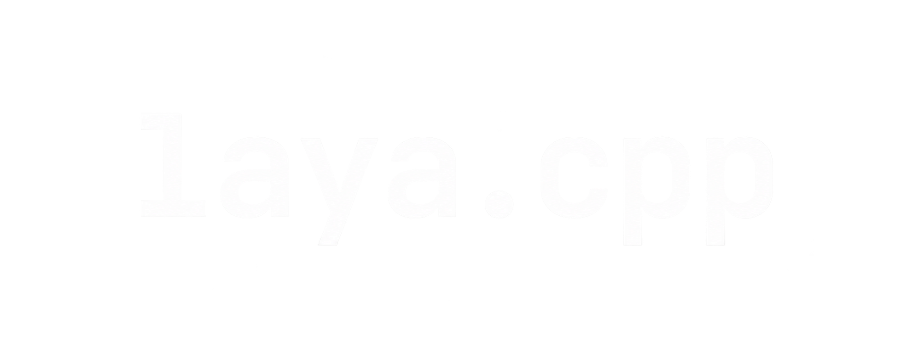

<div align="center">



<h3>Native C++ inference engine for <b>Laya</b>, optimized for low-latency CPU and robotics workloads. Runs the Laya decision model via ONNX Runtime with no Python dependency at inference time.</h3>

<p>


</p>

</div>

## Contents

- [Features](#features)
- [Requirements](#requirements)
- [Quick Start](#quick-start)
- [Model I/O](#model-io)
- [Benchmarks](#benchmarks)
- [INT8 Quantization](#int8-quantization)
- [Scripts](#scripts)
- [Project Structure](#project-structure)
- [Testing](#testing)
- [Acknowledgements & Credits](#acknowledgements--credits)

## Features

- C++17 inference engine (`LayaEngine`) on ONNX Runtime 1.23.2
- CLI runner with built-in latency benchmark (`laya_cli`)
- Python parity reference (`test_parity.py`) - C++ output verified against ONNX Runtime Python
- INT8 dynamic-quantization pipeline (~2.4x speedup, 4x smaller) with output-deviation check
- Reproducible Docker build (pinned C++ and Python ORT versions)

## Requirements

- Docker Desktop (tested with Docker Engine 29.x, WSL2 backend)
- ~3 GB free for the image; models live in `models/`

## Quick Start

```powershell
# Build
docker build -t laya-cpp-runner .

# Interactive shell
docker run --rm -it -v ${PWD}:/workspace laya-cpp-runner bash
```

Inside the container:

```bash
cmake -S /workspace/cpp -B /workspace/cpp/build
cmake --build /workspace/cpp/build -j4
/workspace/cpp/build/laya_cli /workspace/models/laya.onnx
```

One-shot inference without entering the container:

```powershell
docker run --rm -v ${PWD}:/workspace laya-cpp-runner /workspace/cpp/build/laya_cli /workspace/models/laya.onnx
```

## Model I/O

| Tensor           | Shape              | Type  | Description                     |
| ---------------- | ------------------ | ----- | ------------------------------- |
| `input_ids`      | `[batch, seq]`     | int64 | Token IDs                       |
| `attention_mask` | `[batch, seq]`     | int64 | Attention mask                  |
| `marker_pos`     | `[batch, options]` | int64 | Marker positions                |
| `marker_mask`    | `[batch, options]` | bool  | Marker mask                     |
| `qtype`          | `[batch]`          | int64 | Query type                      |
| `logits` →       | `[batch, options]` | float | Raw scores                      |
| `act_probs` →    | `[batch, 2]`       | float | Calibrated action probabilities |

Fetch weights first (needs `pip install huggingface_hub`; source: `receptron/laya-onnx`):

```bash
python3 scripts/download_model.py   # -> models/laya.onnx (+ .data sidecar)
```

Place weights at `models/laya.onnx` (+ `models/laya.onnx.data` sidecar).

## Benchmarks

Measured with `laya_cli` (50 iterations) on Intel i3-1215U via Docker Desktop (8 vCPUs):

| Model                   | Size   | Avg latency | Rate    |
| ----------------------- | ------ | ----------- | ------- |
| `laya.onnx` (FP32)      | 1.6 GB | ~438 ms     | ~2.3 Hz |
| `laya_int8.onnx` (INT8) | 403 MB | ~171 ms     | ~5.8 Hz |

Sufficient for a high-level task/mode selector (~4 Hz); not for 10–50 Hz reactive loops, keep those classical (PID/MPC, local avoidance) and let this model vote on modes above them. Laptop CPUs are noisy (±30% run-to-run); re-measure on target hardware.

## INT8 Quantization

```bash
python3 /workspace/scripts/quantize_int8.py                    # -> models/laya_int8.onnx
python3 /workspace/scripts/compare_int8.py                     # FP32 vs INT8 deviation
/workspace/cpp/build/laya_cli /workspace/models/laya_int8.onnx # benchmark
```

Over 20 randomized inputs: max logit shift 0.44, `act_probs` identical to 6 decimals. Caveats: random token IDs are out-of-distribution (outputs saturate), so verify on real inputs near decision boundaries, and note the temperature calibration in `models/laya_config.json` was fit on FP32 logits. The export's stale `value_info` shapes are stripped automatically during quantization (see script).

## Scripts

| Script                      | Purpose                                       |
| --------------------------- | --------------------------------------------- |
| `scripts/test_parity.py`    | Python reference output for C++ parity checks |
| `scripts/download_model.py` | Fetch ONNX bundle from Hugging Face → models/ |
| `scripts/quantize_int8.py`  | FP32 → INT8 dynamic quantization              |
| `scripts/compare_int8.py`   | FP32 vs INT8 output deviation (fixed seed)    |
| `scripts/bench_threads.py`  | Latency vs intra-op thread count              |

## Project Structure

```
├── cpp/
│   ├── include/laya.hpp    # LayaEngine interface
│   ├── src/laya.cpp        # ONNX Runtime session + inference
│   ├── src/main.cpp        # CLI + latency benchmark
│   └── CMakeLists.txt
├── scripts/                # parity, quantization, benchmarks
├── models/                 # weights (gitignored, not shipped)
├── docs/
├── Dockerfile              # ubuntu:22.04 + ORT 1.23.2 (C++ and Python pinned)
└── README
```

## Testing

```bash
ctest --test-dir /workspace/cpp/build   # SanityTest: CLI forward pass
```

## Acknowledgements & Credits

This project is a native C++ inference engine for **Laya**, optimized for low-latency CPU and robotics workloads. It is based on and inspired by:

- **[receptron/laya](https://github.com/receptron/laya)** (MIT License): TypeScript / ONNX runtime implementation and ONNX export pipeline.
- **[convaiinnovations/laya](https://huggingface.co/convaiinnovations/laya)** (Apache 2.0 License): The original Laya non-autoregressive System-1 decision model architecture and pretrained weights developed by Convai Innovations / NandhaKishorM.
